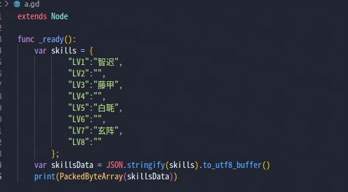
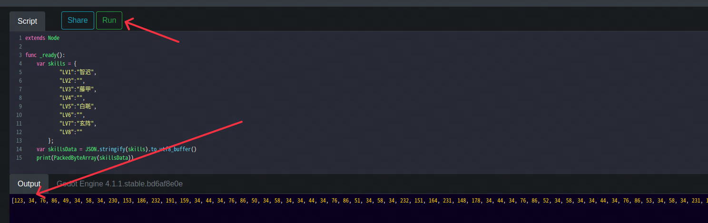
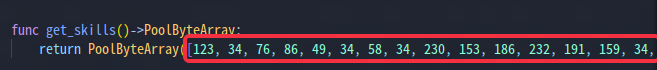
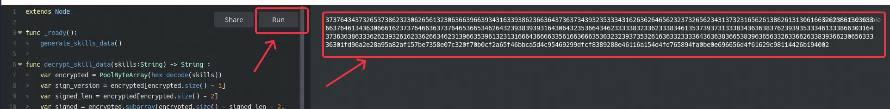
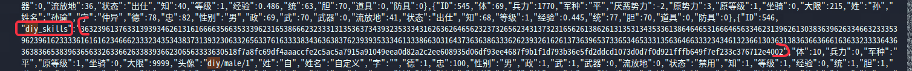

# 技能修改操作步骤

## 第一步
首先，打开 [a.gd](../scripts/a.gd) 文件，如下图：

在技能位置编辑技能名，请确保技能名字正确。

虽然现在8个技能位都是生效的，但是还是请合理修改技能数量，毕竟后面的版本有可能堵住这个漏洞。

修改完成后，打开 [https://gd.tumeo.space/#](https://gd.tumeo.space/#) 这个网站，将修改后的 [a.gd](../scripts/a.gd) 的内容贴上去，点击上面的 `RUN` 按钮，生成技能数据，如下图：

## 第二步
首先，打开 [b.gd](../scripts/b.gd) 文件，找到 `func get_skills()->PoolByteArray:` 这一行，将第一步生成的技能数据替换到下图红色框框位置：

替换完成后，打开 [https://gdscript-online.github.io/](https://gdscript-online.github.io/) 这个网站，将修改后的 [b.gd](../scripts/b.gd) 的内容拷贝进去，点击 `RUN` 按钮，生成技能签名数据：

## 第三步
打开存档文件，找到 `diy_skills` 位置，用第二步生成的数据替换掉即可，如下图：

## 第四步
加载修改过的存档，开玩！！！